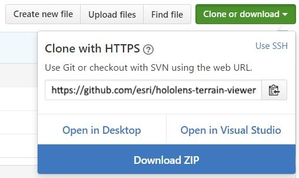

# HOLOLENS TERRAIN SAMPLE

[HoloLens](https://en.wikipedia.org/wiki/Microsoft_HoloLens) is an [mixed reality](https://en.wikipedia.org/wiki/Mixed_reality) visor manufactured by [Microsoft](https://www.microsoft.com/microsoft-hololens/en-us). This github repo contains the source code for an experimental hololens mapping application developed by [Esri](https://www.esri.com/)'s [Prototype Lab](https://maps.esri.com/demo/). The code is intended to be used within a Unity project in conjunction with Microsoft Visual Studio for deployment and packaging.

The app constructs [Unity](https://unity3d.com/) [terrains](https://docs.unity3d.com/ScriptReference/Terrain.html) at runtime from [imagery](https://www.arcgis.com/home/item.html?id=10df2279f9684e4a9f6a7f08febac2a9) and [elevation](http://www.arcgis.com/home/item.html?id=7029fb60158543ad845c7e1527af11e4) sourced dynamically from [ArcGIS Online](https://www.arcgis.com/). The app listens for preset commands to map various locations around the world. The app will also display the physical address of a user defined location (i.e. [reverse-geocoding](https://en.wikipedia.org/wiki/Reverse_geocoding)).

Instructions how to rebuild, redeploy and configure the application are described below.

# SETUP 

Firstly it is strong recommended that the reader become familar with the resources available on Microsoft's [Holographic](https://developer.microsoft.com/en-us/windows/holographic) web portal. The site contains a wealth of information about the HoloLens hardware, tutorials and forums.

## Installing the Prerequisites

As discussed [here](https://developer.microsoft.com/en-us/windows/holographic/install_the_tools) the following applications are required to rebuild the HoloLens sample.

- [Visual Studio 2015 Update 3](http://dev.windows.com/downloads)
- [HoloLens Emulator](http://go.microsoft.com/fwlink/?LinkID=823018)
- [Unity 5.5](https://store.unity.com/download)
... Ensure that "Windows Store" apps are checked in the installation wizard.

## Download the Repo

Download the [HoloLens Terrain Sample](https://github.com/ArcGIS/Esri-HoloLens-Terrain-Sample) from github as a single zip file as pictured below.

Before extracting the downloaded zip file, right click and open the *properties* page. Check *unblock* and then *ok*. This will ensure that the computer will not unintentionally block some of the extracted files.

## Creating a New Unity Project

Start the Unity application, click *New* to specify the name of new project and then click *Create Project*.

Drag the contents of the extracted zip file's *Assets* folder to the *Assets* panel in the Unity application.

