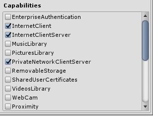

# HOLOLENS TERRAIN VIEWER

[HoloLens](https://en.wikipedia.org/wiki/Microsoft_HoloLens) is an [mixed reality](https://en.wikipedia.org/wiki/Mixed_reality) visor manufactured by [Microsoft](https://www.microsoft.com/microsoft-hololens/en-us). This github repo contains source code for an experimental HoloLens mapping application developed by [Esri](https://www.esri.com/)'s [Prototype Lab](https://maps.esri.com/demo/).  The code is intended to be used within a Unity project in conjunction with Microsoft Visual Studio for deployment and packaging.  

The app constructs [Unity](https://unity3d.com/) [terrains](https://docs.unity3d.com/ScriptReference/Terrain.html) at runtime from [imagery](https://www.arcgis.com/home/item.html?id=10df2279f9684e4a9f6a7f08febac2a9) and [elevation](http://www.arcgis.com/home/item.html?id=7029fb60158543ad845c7e1527af11e4) sourced dynamically from [ArcGIS Online](https://www.arcgis.com/). The app listens for preset commands to map various locations around the world. The app will also display the physical address of a user defined location (i.e. [reverse-geocoding](https://en.wikipedia.org/wiki/Reverse_geocoding)).

Instructions how to build, deploy and configure the application are described below.


# SETUP 

Firstly it is strong recommended that the reader become familiar with the resources available on Microsoft's [Mixed Reality](https://developer.microsoft.com/en-us/windows/mixed-reality) web portal. The site contains a wealth of information about HoloLens hardware, tutorials and forums.

## **Installing the Prerequisites**

As discussed [here](https://developer.microsoft.com/en-us/windows/holographic/install_the_tools) the following applications are required to rebuild the HoloLens sample.

- [Visual Studio 2015 Update 3](http://dev.windows.com/downloads)
- [HoloLens Emulator](http://go.microsoft.com/fwlink/?LinkID=823018)
- [Unity 5.5](https://store.unity.com/download)
   - Ensure that *Windows Store* apps are checked in the installation wizard.

## **Download the Repo**

Download the [HoloLens Terrain Viewer](https://github.com/ArcGIS/holoLens-terrain-viewer) from github as a single zip file as pictured below.


Before extracting the downloaded zip file, right click and open the **properties** page. Check **unblock** and then **ok**. This will ensure that the computer will not unintentionally block some of the extracted files.


## **Creating a New Unity Project**

Start the Unity application, click **New** to specify a name for the new project and then click **Create Project**.


Drag the contents of the extracted zip file's **Assets** folder to the **Assets** panel in the Unity application.


The dropped files include the Microsoft's open sourced [HoloToolkit](https://github.com/Microsoft/HoloToolkit-Unity) and a few scripts authored by the Prototype Lab in the *EsriToolkit* folder and a pre-authored Scene.

## **Adjust Project Quality Settings**

1. Select **Edit** > **Project Settings** > **Quality**
2. Select the **dropdown** under the **Windows Store** logo and select **Fastest**. You'll know the setting is applied correctly when the box in the Windows Store column and **Fastest** row is green.


## **Adjust Project Holographic Settings**

1. Select **Edit** > **Project Settings** > **Player**
2. Select the **Windows Store** tab.
3. Expand the **Other Settings** group.
4. In the **Rendering** section, check the **Virtual Reality Supported** checkbox to add a new **Virtual Reality Devices** list and confirm **"Windows Holographic"** is listed as a supported device.


## **Adjust Project Capabilities**

1. Select **Edit** > **Project Settings** > **Player**
2. Select the **Windows Store** tab.
3. Expand the **Publish Settings** group.
4. Check the following boxes in the **Capabilities** list:
   - InternetClient
   - InternetClientServer
   - PrivateNetworkClientServer
   - Microphone
   - SpatialPerception



## **Add Pre-Authored Scene**

1. Select the **Scene** folder in the **Assets** folder hierarchy in the **Project** panel.
2. Drag the **Terrain** scene from the **Project** panel and drop it into the **Hierarchy** panel.
3. If the **Hierarchy** panel already included an **Untitled** scene then right click on it and select **Remove Scene**.
 


## **Building the Unity Project**

1. Select **File** > **Build Settings...**
2. Click **Add Open Scenes**
3. Select **Windows Store** in the Platform list
4. Click **Switch Platform**
5. Set **SDK** to **Universal 10**
6. Set **Build Type** to **D3D**
7. Check **Unity C# projects**
8. Click **Build**


When prompted to select an output folder, create a new project sub-folder called **App**. Highlight the newly created folder, click **Select Folder**.


## **Configuring the Visual Studio Solution**

1. Open the newly created **App** folder using Windows Explorer. For example, on my computer this would be: *C:\Users\richie\Documents\Unity\HoloMapSample\App*
2. Double click on the Visual Studio Solution created by Unity in this folder.
3. When Visual Studio opens, select an **x86** build configuration for the app.


## **Congratulations!**

You are now ready to:
1. Deploy the app to a remote HoloLens over Wifi or USB,
2. Run the app in the HoloLens emulator, or
3. Create a deployment package.

For detailed instructions on all three of these please visit [Microsoft - Mixed Reality Development - Using Visual Studio](https://developer.microsoft.com/en-us/windows/mixed-reality/using_visual_studio).


# CONFIGURATION 

As demonstrated in [this video](https://www.youtube.com/watch?v=hE9GXpZTwAs), voice commands are used to navigate to locations around the world.  At each location a terrain map is built and displayed.  These *locations* and *commands* are preset in file called [Place.cs](./Assets/EsriToolkit/Mapping/Scripts/Place.cs).

In the following snippet, the ***Place*** class contains two preset locations, the [Hoover Dam](https://en.wikipedia.org/wiki/Hoover_Dam) and [Mount Everest](https://en.wikipedia.org/wiki/Mount_Everest). A user would view the Hoover Dam by speaking "*show hoover dam*". Ideally, to improve speech recognition reliability, place names should contain multiple words and syllables.

The **Level** property denotes the AGOL zoom level. For most locations a zoom level of 9 or 10 is recommended, however due to higher resolution elevation in the United States the zoom level can be as high as 11 or 12.

```
namespace Esri.PrototypeLab.HoloLens.Unity {
    public class Place {
        public string Name { get; set; }
        public Coordinate Location { get; set; }
        public int Level { get; set; }
        public static Place[] PresetPlaces {
            get {
                return new Place[] {
                    new Place() {
                        Name = "hoover dam",
                        Location = new Coordinate() {
                            Longitude = -114.737778f,
                            Latitude = 36.015556f
                        },
                        Level = 12
                    },
                    new Place() {
                        Name = "mount everest",
                        Location = new Coordinate() {
                            Longitude = 86.925278f,
                            Latitude = 27.988056f
                        },
                        Level = 10
                    }
                };
            }
        }
    }
}

```

# MISCELLANEOUS TIPS AND TRICKS

1. Newly created Visual Studio Solutions exported from Unity rarely build successfully the first time. Building projects individually on new solutions seems to eliminate initial build errors.
2. Use [Wikipedia](https://www.wikipedia.org/) to get the location of a well known location in decimal degrees.
3. Don't forget to [pair](https://developer.microsoft.com/en-us/windows/holographic/using_the_windows_device_portal#creating_a_username_and_password) your HoloLens and enable [developer mode](https://developer.microsoft.com/en-us/windows/holographic/using_the_windows_device_portal#setting_up_hololens_to_use_windows_device_portal).

# ISSUES

Find a bug or want to request a new feature?  Please let us know by submitting an issue.

# CONTRIBUTING

Anyone and everyone is welcome to [contribute](CONTRIBUTING.md).

# LICENSING
Copyright 2014 Esri

Licensed under the Apache License, Version 2.0 (the "License");
you may not use this file except in compliance with the License.
You may obtain a copy of the License at

   http://www.apache.org/licenses/LICENSE-2.0

Unless required by applicable law or agreed to in writing, software
distributed under the License is distributed on an "AS IS" BASIS,
WITHOUT WARRANTIES OR CONDITIONS OF ANY KIND, either express or implied.
See the License for the specific language governing permissions and
limitations under the License.

A copy of the license is available in the repository's [license.txt](license.txt) file.

